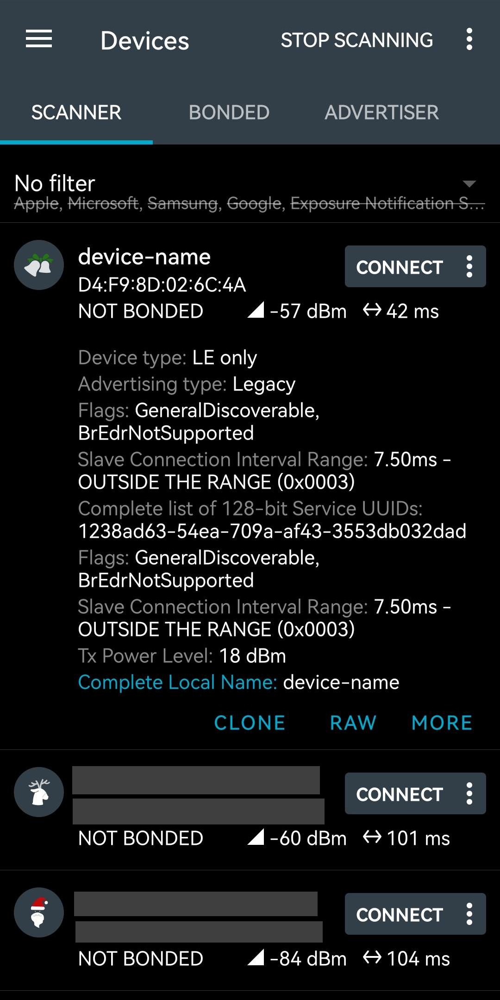
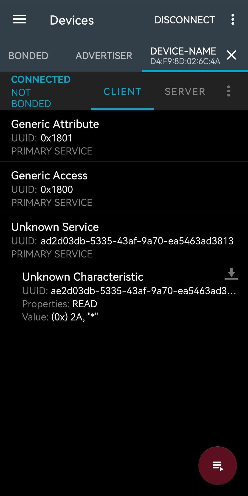

# Documentation of the BLE interface for LispBM

## Introduction

The BLE interface provides a set of function allowing you to control control the
devices BLE behavior from LispBM scripts, allowing it to act as a BLE server.
The library is quite limited at the moment (it does not support encryption at
all at the moment for instance). It only supports the following actions:

1. Defining services with UUIDs and a list of characteristics with their own UUIDs.
2. Defining the access permissions of said charactersistics, including read, write,
   write no response, notify, and indicate.
3. Defining a list of charactersistic descriptors to assign to a characteristic.
4. Reading and writing the values of the characteristics and their descriptors.
5. Customizing the advertisement and scan response packets sent.

## Configuring BLE Scripting

To make use of the BLE scripting library, you first need to configure the custom
config of the VESC in VESC Tool. This is done by first connecting your VESC to
VESC Tool and then going to **VESC Express** > **Bluetooth** and setting
**Bluetooth Mode** to **Enabled with Scripting**. Don't forget to write the
value after editing it! Note that this will disable your ability to connect
VESC Tool through Bluetooth. It is currently not possible to connect VESC Tool
through Bluetooth while BLE scripting is enabled. If this option isn't enabled,
the libraries extensions are simply not defined.

You also need to configure the amount of services, characteristics and
descriptors you plan to define. Internal arrays that contain these are allocated
at startup, so you need to define the sizes of these. This is done through the
**BLE Service Capacity** and **BLE Characteristic and Descriptor Capacity**
settings. The characteristic and descriptor capacity setting counts the sum of
the number characteristics and descriptors.

**Note**: These settings only take effect after a reboot, which can be achieved
by selecting **Terminal** > **Reboot**.

## The Library

### `ble-start-app`

```clj
(ble-start-app)
```

This starts the BLE server with the configured name, allowing other devices to
connect and you to create services.
This should be called once at the start of the program. It has no effect on
subsequent calls (currently, the only way to stop the BLE server is to power
cycle the VESC). It returns `true` the first time it is called and `nil` on
subsequent calls.

This function may throw an `eval_error` if some previous internal mechanism
has failed.

### `ble-set-name`

```clj
(ble-set-name name)
```

Configure the name that the BLE server advertises as the device's name. So
essentially, the devices name in the BLE system.

The name must not be longer than 30 characters. Providing a longer name will
throw an `eval_error`. In practice the limit is probably much shorter, since the
name is placed in a advertising packet together with other data which has a
limit of 31 bytes in total. (TODO: The precise mechanics of this need to be figured
out.)

This should be called *before* the BLE server has started (so before
[`ble-start-app`](#ble-start-app) is called). Then `true` is returned. Calling it afterwards has no effect
and returns `nil`.

### `ble-conf-adv`

```clj
(ble-conf-adv false)
(ble-conf-adv use-custom adv-data scan-rsp-data)
```

Configure the if custom advertising data should be used, and which packets to
send in that case. `use-custom` is a bool which if true specifies that the
custom advertising and scan response packets should be used. If false,
`adv-data` and `scan-rsp-data` are ignored and do not need to be provided, since
a standard packet is used instead (see the example below to see its contents).

`adv-data` and `scan-rsp-data` are used to specify the packets that are used
with advertising and scan responses. They can either be an array which specifies
the raw bytes to be sent as the packet, or a list with cons cells of the form
`(name-symbol-or-number . array)` (Must be an integer from 1 to 255 inclusive if
a number, see [BLE Advertising](#ble-advertising) for valid symbols and other
details). If the resulting packet is longer than 31
bytes an `eval_error` is thrown. You can pass `nil` for either to specify that
it should not be updated and that the previously configured packet should remain
in effect (both custom packets are initialized to be an empty array before
configuring them with `ble-conf-adv`).

This extension returns `nil` in the case of an unknown error occuring
related to the internal BLE APIs. Otherwise `true` is returned.

This extension can be called before or after the BLE server has been started
with [`ble-start-app`](#ble-start-app), so at any time. Calling it after the BLE
server has been started will cause advertising to restart automatically.

This function takes raw or almost completely raw packets, so you should read the section
about [BLE Advertising](#ble-advertising) if you're unsure about BLE internals.

Example that disables custom advertising and scan response packets:
```clj
(ble-conf-adv false)
```

Example that sets an advertising packet configuring the name `"test"` and some
flags. It also configures an empty scan-response by leaving it unchanged.
```clj
(def adv-data `(
    (flags . [0x06])
    (name-complete . ,(buf-resize "my-device" -1)) ; We shrink it to not include the terminating null byte.
))

(ble-conf-adv true adv-data nil)
> t
```

The following example configures packets that are identical to the ones sent by
default (assuming that you'd configured the device name to be "test").
```clj
(def adv-data `(
    (flags . [0x06])
    (name-complete . [0x74 0x65 0x73 0x74]) ; "test" in ascii
    (conn-interval-range . [0x06 0x00 0x03 0x00])
))
(def scan-rsp-data `(
    (flags . [0x06])
    (tx-power-level . [0x12])
    (conn-interval-range . [0x06 0x00 0x03 0x00])
))

(ble-conf-adv true adv-data scan-rsp-data)
```

Example that configures the same default packets using raw byte-arrays instead:
```clj
(def adv-data [
    0x02 0x01 0x06                ; flags
    0x05 0x09 0x74 0x65 0x73 0x74 ; name-complete
    0x05 0x12 0x06 0x00 0x30 0x00 ; conn-interval-range
])
(def scan-rsp-data [
    0x02 0x01 0x06                ; flags
    0x02 0x0A 0x12                ; tx-power-level
    0x05 0x12 0x06 0x00 0x30 0x00 ; conn-interval-range
])

(ble-conf-adv true adv-data scan-rsp-data)
```

### `ble-add-service`

```clj
(ble-add-service service-uuid characteristics)
```

Add a service with the given list of characteristics.

This function needs to be called after [`ble-start-app`](#ble-start-app) has been
called. Calling it before will throw an `eval_error`.

The service-uuid is given as a byte array representing either a 16-, 32-, or
128-bit UUID, so it should be 2, 4, or 16 bytes long. The order of the bytes is
big endian, which means that you write the bytes in the same order as you would
write it in text (so the UUID 4be24176-71ae-11ee-b962-0242ac120002 would be represented
by the lbm value `[0x4b 0xe2 0x41 0x76 0x71 ... 0x12 0x00 0x02]`).

This function returns a list of service, characteristic, and descriptor handles
in the order they were defined, with the service handle being first (See the
example below). This function can also return a `type_error` or `eval_error`.

#### `characteristics` Format

The characteristics list is defined by a list of associative lists, where each
assoc list defines a single characteristic. Assoc lists are lists with cons
cells as items. Where the car fields hold the lists keys, while the cdr fields
hold the keys respective values.

The valid entries are as follows:
- `'uuid`: The characteristic's UUID, same format as the service UUID.
- `'prop`: A list of any combination of the symbols `'prop-read`, `'prop-write`,
  `'prop-write-nr`, `'prop-indicate`, `'prop-notify`, which correspond to the
  access flags for this characteristic.
- `'max-len`: The maximum value length (in bytes) that can be written to this
  characteristic.
- `'default-value` \[optional\]: A byte array which will be set as the
  characteristics initial value. The length of this should not be longer than
  `max-len`.
- `'descr` \[optional\]: A list of descriptors to assign to this characteristic
  (see below).

The descriptor list follows a very similar format to the characteristic list,
except only the `'uuid`, `'max-len`, and `'default-value` entries are valid.

**Note**: If you configure `'prop` to include either of the flags `prop-indicate` or
`prop-notify`, you also need to include a client characteristic control (CCC)
descriptor. This is easily done by adding a characteristic with the 16-bit UUID
`[0x29 0x02]`, a max length of 2, and a initial value of `[0 0]` (see the example below).  

#### Example

```clj
(ble-add-service [0xbe 0xb5 0x48 0x3e] '(
    (
        (uuid . [0xbe 0xb5 0x48 0x4e])
        (prop . (prop-read prop-write prop-notify))
        (max-len . 100)
        (descr . (
            (
                (uuid . [0x29 0x02]) ; the ccc-uuid
                (max-len . 2)
                (default-value . [0 0])
            )
        ))
    )
))
> (40u 42u 43u)
```

This creates a service with the 32-bit UUID [0xbe 0xb5 0x48 0x3e] with a single
characteristic that has the 32-bit UUID [0xbe 0xb5 0x48 0x4e] (these UUIDs are
complete nonsense). Client devices are allowed to read, write the value of this
characteristic, which can at most be 100 bytes long.

Clients are also allowed to subscribe to notifications of changes to the value,
which is why we need to add the CCC descriptor to the characteristic. The value
of and behavior of this descriptor is handled automatically by the BLE server.
Note that we also could have defined any other characteristics if we wanted to.

This function then returns a list of handles. The service handle 40 comes first,
followed by the characteristic and descriptor handles 42 and 43 respectively.
These can be used with the other library functions.

### `ble-remove-service`

```clj
(ble-remove-service service-handle)
```

Remove the given service, along with the associated characteristics and
descriptors, freeing the resources in the process. `service-handle` should be a
number which was the first number in the list of handles returned by
[`ble-add-service`](#ble-add-service).

Due to technical limitations (that should probably be possible to remove),
services need to be removed in the reverse order they were created in. Say you
created two services, **Service A** and then **Service B**, in that order. To
remove them, you would have to first remove **Service B**, followed by
**Service A**. This is because the services are stored on a stack internally, so
you need to pop them in the order you usually would with a stack.

Example which remove the service with the handle 40, which was the service which was
created last:

```clj
(ble-remove-service 40)
> t
```

### `ble-attr-get-value`

```clj
(ble-attr-get-value attr-handle)
```

Get the current value of a characteristic or descriptor (referred to generally as
an attribute) as a byte array. `attr-handle` should be a number
returned by [`ble-add-service`](#ble-add-service).

Providing an invalid handle will throw an `eval_error`.

Example where the value of the attribute with the handle 42 is set to the
byte-array `"hello"`, and then queried:

```clj
(ble-attr-set-value 40 "hello")
(ble-attr-get-value 40)
> "hello"
```

### `ble-attr-set-value`

```clj
(ble-attr-set-value attr-handle value)
```

Set the value of the attribute to the provided value. `attr-handle` should be a
number that was returned by [`ble-add-service`](#ble-add-service) and `value` a byte
array. **Note** that the raw byte without modification will be stored, and since strings are null
terminated in LBM, setting the value to a string literal will include the
terminating null byte. You will have to create a copy of the byte array without
the final byte to avoid this behavior. Here is an example function that does
this using
[`bufcpy`](https://github.com/vedderb/bldc/blob/master/lispBM/README.md#bufcpy):
```clj
(defun trim-null-byte (str) {
    (var len (str-len str))
    (var cpy (bufcreate len))
    (bufcpy cpy 0 str 0 len)
    cpy
})
```

Providing an invalid handle will throw an `eval_error`.

Setting the value of a characteristic automatically sends notifications or
indications to subscribing clients if those flags were set when the
characteristic was defined.

Example that sets the value of the attribute with the handle 40 to "hello":
```clj
(ble-attr-set-value 40 "hello")
; it now contains the bytes [0x68 0x65 0x6c 0x6c 0x6f 0x0]
```

### `ble-get-services`

```clj
(ble-get-services)
```

Get the list of the handles of the currently active services, excluding any
services that have already been removed. The handles are returned in the order
they were created in. If you want to remove them, you would need to reverse the
list first!

Example that gets the currently active service handles:

```clj
(ble-get-services)
> (40u)
```

In this case, only a single service had been created.

### `ble-get-attrs`

```clj
(ble-get-attrs service-handle)
```

Get the list of characteristic and descriptor handles assigned to the given service
when it was created. `service-handle` should be a number that was returned by
[`ble-add-service`](#ble-add-service). Providing an invalid handle throws an
`eval_error`.

This function essentially returns the same list returned when `ble-add-service` was
first called, just without the first item (since that item would correspond to the service's
handle).

Example where the attribute handles of the service 40 are queried:

```clj
(ble-get-attrs 40)
> (42u 43u)
```

In this case, the service was defined with a single characteristic with a
descriptor that had the handles 42 and 43 respectively.

## Events
Too know when a client has written to a characteristic or descriptor, an LBM
event is fired. The semantics work the same as with
[normal events](https://github.com/vedderb/bldc/blob/master/lispBM/README.md#events).
The event message consists of a list of the form
`('event-ble-rx handle data)`, where the `handle` is the handle number of the
attribute's that was written to, and the `data` is the byte-array that was
written by the client.

Here is an example of a setup that catches and logs these events, printing the
values as strings:
```clj
(defun proc-ble-data (handle data) {
    (print (str-merge
        "Value "
        (to-str data)
        " written to attribute handle "
        (str-from-n handle)
    ))
})

(defun event-handler ()
    (loopwhile t
        (recv
            ((event-ble-rx (? handle) (? data)) (proc-ble-data handle data))
            (_ nil) ; Ignore other events
        )
    )
)

(event-register-handler (spawn event-handler))
(event-enable 'event-ble-rx)
```

## BLE Advertising

> Back to [`ble-conf-adv`](#ble-conf-adv)

These APIs require you to configure advertising and scan response packets by
giving the raw bytes. This is to allow you as much as control as possible,
something which is very important because the packets can only be up to 31 bytes
long each, so optimizing their size is crucial. If this sounds intimidating
fret not, as it's not that complicated as this guide should hopefully make
clear!

To make it slightly nicer to specify these packets than to just having to give a
single long byte-array, there is a alternative syntax where you give a list of
the fields present in the packet. You can also just give raw arrays if that is
more convenient. Each field is a cons cell of the form
`(type-symbol-or-number . array)`. The car field corresponds to the type of the
field, and should normally be one of the symbols defined in the list below. But
since there are a large number of types, and memory is limited, only a handful
of types are given dedicated symbols. You can therefore also specify the type
with the integer as defined in the specification. The cdr field on the other
hand corresponds to the raw data associated with the field type and should
therefore be a byte-array.

Here is a list of all defined type symbols and their meanings. These are
taken from the [**Bluetooth Assigned Numbers, Section 2.3**](#references)
document.

| Type | Number | Description | Reference |
| -- | -- | -- | -- |
|`'flags`| `0x01` | General config flags. It is a bit field containing low level information about capabilities, see example for a reasonable default, or the reference for the individual bit fields. | [**Bluetooth Core Specification Supplement, Part A, Section 1.3**](#references) |
|`'incomplete-uuid-16`| `0x02` | Incomplete list of 16-bit service uuids, meaning that there are more 16-bit services available. | [**Bluetooth Core Specification Supplement, Part A, Section 1.1**](#references) |
|`'complete-uuid-16`| `0x03` | Complete list of 16-bit service uuids, meaning that every 16-bit service is listed. | [**Bluetooth Core Specification Supplement, Part A, Section 1.1**](#references) |
|`'incomplete-uuid-32`| `0x04` | Incomplete list of 32-bit service uuids, meaning that there are more 32-bit services available. | [**Bluetooth Core Specification Supplement, Part A, Section 1.1**](#references) |
|`'complete-uuid-32`| `0x05` | Complete list of 32-bit service uuids, meaning that every 16-bit service is listed. | [**Bluetooth Core Specification Supplement, Part A, Section 1.1**](#references) |
|`'incomplete-uuid-128`| `0x06` | Incomplete list of 128-bit service uuids, meaning that there are more 128-bit services available. | [**Bluetooth Core Specification Supplement, Part A, Section 1.1**](#references) |
|`'complete-uuid-128`| `0x07` | Complete list of 128-bit service uuids, meaning that every 16-bit service is listed. | [**Bluetooth Core Specification Supplement, Part A, Section 1.1**](#references) |
|`'name-short`| `0x08` | A shortened version of the complete name. This signifies that a client could query the complete name by reading the device name characteristic after connecting. Must consist of a contiguous series of characters from the start of the full name. | [**Bluetooth Core Specification Supplement, Part A, Section 1.2**](#references) |
|`'name-complete`| `0x09` | The complete device name. This is normally the one which you would use. | [**Bluetooth Core Specification Supplement, Part A, Section 1.2**](#references) |
|`'tx-power-level`| `0x0A` | Named "Tx Power Level": the transmitted power level, see the reference for details. | [**Bluetooth Core Specification Supplement, Part A, Section 1.5**](#references) |
|`'device-id`| `0x10` | Not sure what this does, the specification just references "Device ID Profile". | :/ |
|`'conn-interval-range`| `0x12` | Named "Peripheral Connection Interval Range", see the reference for details.  | [**Bluetooth Core Specification Supplement, Part A, Section 1.9**](#references) |
|`'service-data-16`| `0x16` | Named "Service Data - 16-bit UUID", consists of a single 16-bit UUID followed by arbitrary length service data. Can be given multiple times to give service data for multiple services. | [**Bluetooth Core Specification Supplement, Part A, Section 1.11**](#references) |
|`'service-data-32`| `0x20` | Named "Service Data - 32-bit UUID", consists of a single 32-bit UUID followed by arbitrary length service data. Can be given multiple times to give service data for multiple services. | [**Bluetooth Core Specification Supplement, Part A, Section 1.11**](#references) |
|`'service-data-128`| `0x21` | Named "Service Data - 128-bit UUID", consists of a single 128-bit UUID followed by arbitrary length service data. Can be given multiple times to give service data for multiple services. | [**Bluetooth Core Specification Supplement, Part A, Section 1.11**](#references) |
|`'appearance`| `0x19` | A apperance ID which specifies the general type of device such as "Phone" or "Thermometer". The values are specified in [**Bluetooth Assigned Numbers, Section 2.6**](#references) document. See the reference for a more general description. | [**Bluetooth Core Specification Supplement, Part A, Section 1.12**](#references) |
|`'manufacturer-data`| `0xFF` | Named "Manufacturer Specific Data", the first two bytes are a company ID as specified by [**Bluetooth Assigned Numbers, Section 7**](#references), followed by a blob of arbitrary data. See the reference for more details. | [**Bluetooth Core Specification Supplement, Part A, Section 1.4**](#references) |

In BLE advertising and scan response packets fields are formatted as
a single byte specifying the length in bytes of the field type + data, followed
by another single byte specifying the type of the field (one of the numbers in
the table above), finished by length - 1 bytes containing the field data. So to
calculate the size of a packet you can simply sum up the results of
`2 + data-length` for each field (where `data-length` is the length of the
byte-array given for the field).

The advertising and scan response packets can not be larger than 31 bytes each.

In general, you can use the scan response packet to specify additional data that
didn't fit in 31 bytes of the advertising packet. The advertising packet is sent out
passively, while the scan response packet must be actively requested by the
client. It's not entirely clear to me when you need to duplicate fields across
the two packets, it seems like it's not well defined how clients react. If you
notice me doing something stupid (like if specifying the connection interval
range twice is unnecessary) please just ignore it (a PR/email would be greatly
appreciated though 
\<[rasmus.soderhielm@gmail.com](mailto:rasmus.soderhielm@gmail.com)\>). There is
a [Stack Overflow answer](https://stackoverflow.com/a/31518806) which gives some
nice insights about the roles of the advertising and scan response packets.

All this is to say that you should not be afraid to play around and to try
removing the more unclear fields like `flags` or `conn-interval-range` to see
what works and doesn't. :)

### Example

Let's finally go through an example of a server with a single characteristic
with the constant value `42`.

Note that the UUID `ad2d03db-5335-43af-9a70-ea5463ad3813` was picked at random
and has no special meaning.

```clj
(def service-uuid [0xad 0x2d 0x03 0xdb 0x53 0x35 0x43 0xaf 0x9a 0x70 0xea 0x54 0x63 0xad 0x38 0x13])
(def chr-uuid [0xae 0x2d 0x03 0xdb 0x53 0x35 0x43 0xaf 0x9a 0x70 0xea 0x54 0x63 0xad 0x38 0x13]) ; notice the first byte
(def name "device-name")
; We need a copy of name as buf-resize mutably changes the provided buffer.
(def name-bytes (buf-resize "device-name" -1)) ; Remove the terminating null byte.

; Resulting packet size: 27
(def adv-data `(
    (flags . [0x06])
    (conn-interval-range . [0x06 0x00 0x03 0x00])
    (complete-uuid-128 . ,chr-uuid)
))
; Resulting packet size: 25
(def scan-rsp-data `(
    (flags . [0x06])
    (conn-interval-range . [0x06 0x00 0x03 0x00])
    (tx-power-level . [0x12])
    (name-complete . ,name-bytes)
))

; Remove any existing services (services are not automatically removed when
; reloading a script!)
(map ble-remove-service (ble-get-services))

(ble-conf-adv true adv-data scan-rsp-data)
(ble-set-name name)

(ble-start-app)

(ble-add-service service-uuid `(
    (
        (uuid . ,chr-uuid)
        (prop . (prop-read))
        (max-len . 1)
        (default-value . [42])
    )
))
```

We configure the `'complete-uuid-128` field to inform any clients scanning for
our service that we have it. Also notice that we still configure the device name
using [`ble-set-name`](#ble-set-name) even though we already configured it in
the scan response packet. This is because the device name given through
`ble-set-name` is still used in the auto generated **Generic Access** service.

We're going to use the
[nRF Connect app (android)](https://play.google.com/store/apps/details?id=no.nordicsemi.android.mcp&pcampaignid=web_share)
to connect to our BLE server.
([It is also available for IOS](https://apps.apple.com/se/app/nrf-connect-for-mobile/id1054362403),
but the UI is different and has less
details.)

If we run this code and open nRF Connect, we can find our device "device-name"
in the scanner list.



When connecting we see our characteristic
`ae2d03db-5335-43af-9a70-ea5463ad3813` with the value 42 (or `0x2A` in hex).



### References

I've referenced the official Bluetooth specifications a lot in this section, but
since most of the Bluetooth documents don't have any bookmarks, linking directly
to the relevant sections is difficult. So you'll unfortunately have to go to the
mentioned sections yourself.

But here is a table of links to the specifications mentioned:

|Document|Link|Direct Link to PDF (May or May Not be dead)|
|--|--|--|
| **Bluetooth Assigned Numbers** | https://www.bluetooth.com/specifications/assigned-numbers/ | https://www.bluetooth.com/wp-content/uploads/Files/Specification/Assigned_Numbers.pdf?id=2289 |
| **Bluetooth Core Specification Supplement** | https://www.bluetooth.com/specifications/specs/core-specification-supplement-11/ | https://www.bluetooth.org/DocMan/handlers/DownloadDoc.ashx?doc_id=556598 (will download the PDF) |

In case any of the links have died since writing this you can try to search for
the document name without the **Bluetooth** part here:
https://www.bluetooth.com/specifications/specs/?types=specs-docs