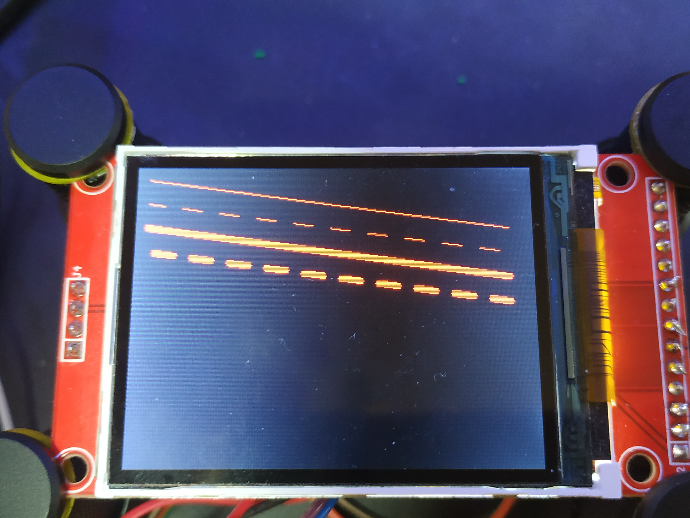
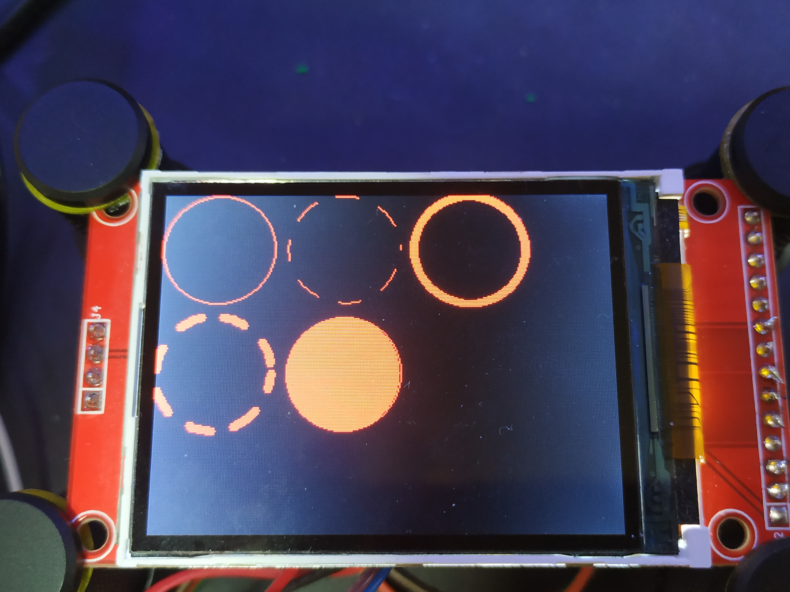
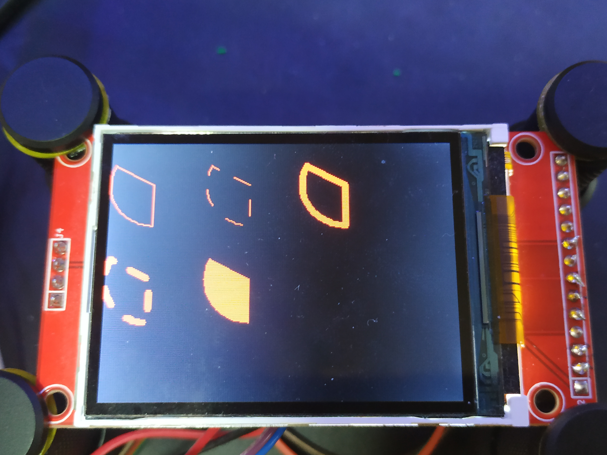
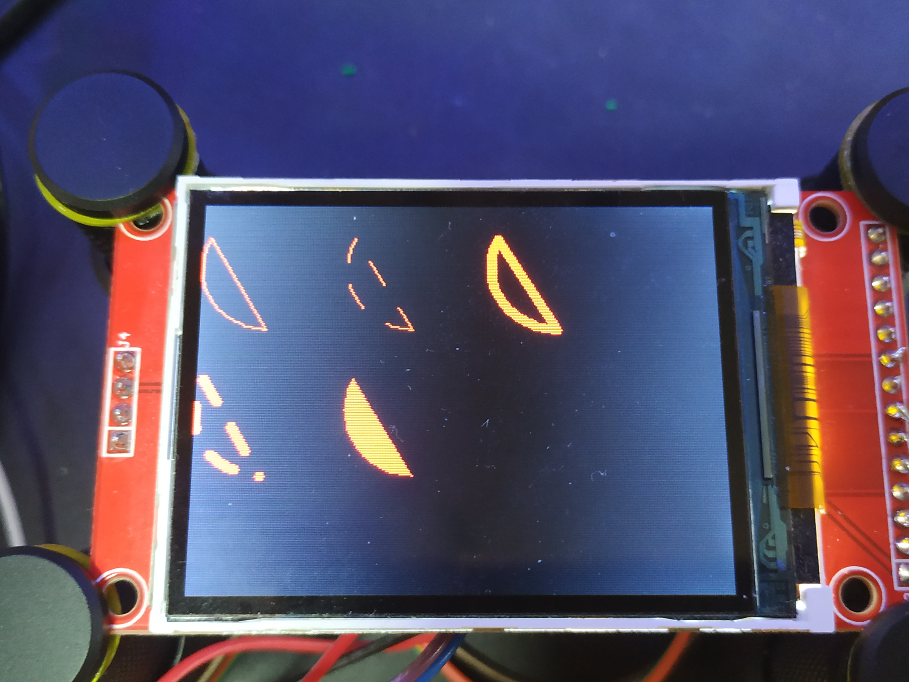
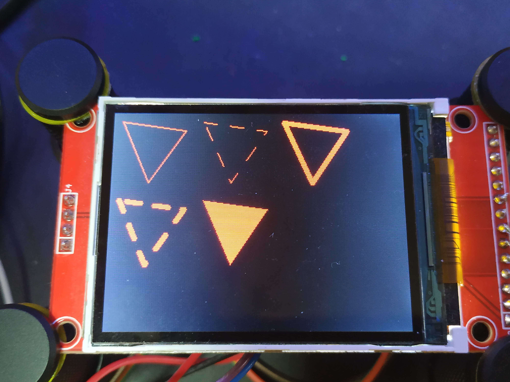
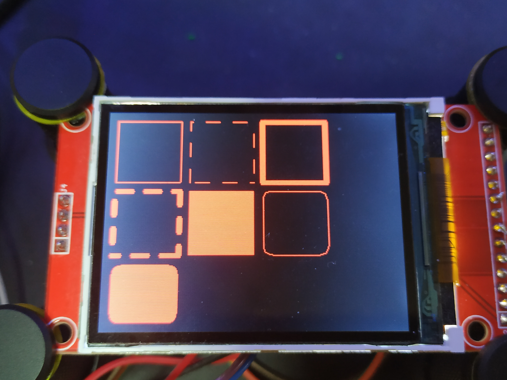
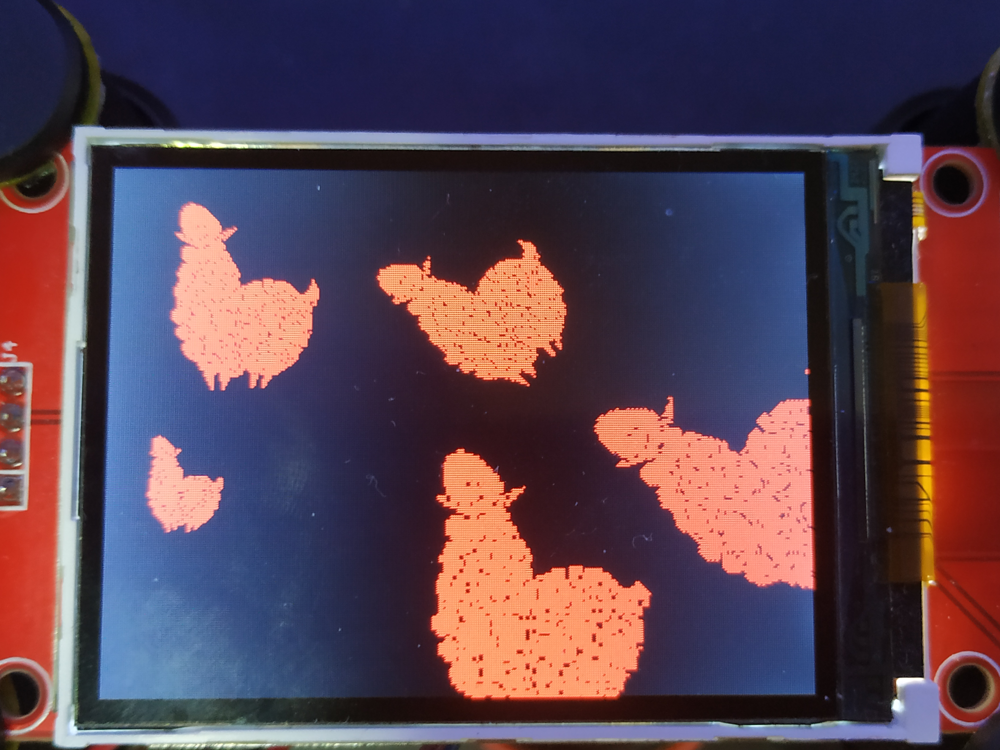

# Documentation for graphics library and display drivers

# Introduction

The graphics library provides a set of functions for drawing onto rectangular
images, called Image-buffers, from LispBM. 

Drivers for a specific display is loaded with the associated `disp-load` function:

1. disp-load-sh8501b
2. disp-load-ili9341
3. disp-load-ssd1306

Each disp-load function takes arguments specific to the display. These are
explained below.

Each display driver provides a "rendering", "clearing" and "reset"
function that is connected to the LispBM extensions `disp-render`,
`disp-clear` and `disp-reset` upon loading. The render, clear and
reset functions are the display dependent interface that must be
implemented per display.

## Image-buffers

The graphics library is based on image-buffers, that are rectangular arrays
of pixels where all pixels are of a certain format. The formats we support in
image-buffers are:
1. indexed2 - 2 colors (1 bit per pixel) 
2. indexed4 - 4 colors (2 bits per pixel)
3. rgb332   - 8Bit color
4. rgb565   - 16Bit color
5. rgb888   - 24Bit color

Image-buffers can be created in two ways using the graphics library:
1. `img-buffer` - allocates a blank image-buffer in lbm memory.
2. `img-buffer-from-bin` - creates an image-buffer from an image imported into the script.

For example, creating a 100x100 image-buffer of `indexed2` colors is done as:

```clj
(def my-img (img-buffer 'indexed2 100 100))
```

When drawing on `indexed2` or `indexed4` image-buffers, colors are expressed
as an integer. 0,1 for `indexed2` and 0,1,2,3 for `indexed4`. For `rgb332`, `rgb565`
and `rgb888` image-buffers a color is given in hex notation 0xRRGGBB. 

Example that draws a line from pos (0,0) to pos (90,90) in color 1 on an `indexed2` image-buffer:

```clj
(img-line my-img 10 10 90 90 1)
```

When an image-buffer is rendered onto the display (using the
disp-render function) the colors of the image-buffer are mapped to the
color space of the display.  In the case of `indexed2` and `indexed4`
this mapping is performed using a list of target colors expressed in
RGB888 format. 

Note that the RAM requirement of a 100x100 image is:
1. at indexed2: 1250 Bytes
2. at indexed4: 2500 Bytes
3. at rgb332:   10000 Bytes
4. at rgb565:   20000 Bytes
5. at rgb888:   30000 Bytes

There are a number of function for drawing onto an image-buffer:
1. img-setpix
2. img-line
3. img-text
4. img-clear
5. img-circle
6. img-arc
7. img-circle-sector
8. img-circle-segment
9. img-rectangle
10. img-triangle
11. img-blit

The purpose of most of these are given by their names. `img-blit` draws an
image onto another image and can while doing so rotate and scale the image it
is drawing. More details on each of these functions are available in the later
reference sections. 

The functions that draw onto an image-buffer takes optional arguments
that specify extra attributes to apply when drawing. These attributes are:

1. `'(thickness w)`: Line thickness w 
2. `'(dotted d-len d-space-len)`: Dotted or dashed lines with `d-len` long line segments separated by `d-space-len`.
3. `'(filled)` : Specifies that the shape should be filled. 
4. `'(rounded radius)` : Specifies that the shape should have rounded corners. 
5. `'(scale scale-f)` : Scale the image by factor `scale-f`
6. `'(rotate rx ry deg)` : Rotate an image around point (`rx`,`ry`), `deg` degrees. 
 
Not all attributes are applicable to all drawing functions. The
applicable attributes for each drawing-function is listed in the
description of the function in the reference section. 

## Rendering and color mapping

An image-buffer can be rendered to the display using `disp-render`.
If the image is an `indexed2` or `indexed4` color image, it is when
rendering the image you decide what color each index in the image represents. 

For example you can draw an indexed2 image using a very red and a green color as:
```clj
(disp-render my-img 10 10 '(0x00FF00 0xFF0000))
```

The code above draws `my-img` at location (10,10). Zeroes in the image will be drawn
using color `0x00FF00`, maximum green, and ones will be drawn as `0xFF0000` maximum red.

For rgb332, rgb565 and rgb888 formats the color mapping list is ignored and
can be empty.

More advanced color mapping schemes can be represented using a color type
that is created using the `img-color` or `img-color-setpre` functions. The color
type can represent normal colors, such as 0xFF0000, but can also represent
gradients to be applied to the image in x or y direction upon rendering.

# Displays
 
## sh8501b

* Resolution: 194 * 368
* Colors: 16Bit
* Interface: SPI

Compatible with all image formats supported by the graphics library.


### disp-load-sh8501b

```clj
(disp-load-sh8501b gpio-sd0 gpio-clk gpio-cs gpio-reset spi-mhz)
```

Loads the sh8501b driver. The driver uses hardware-SPI at rate `spi-mhz` on the
`gpio-sd0` and `gpio-clk` GPIO pins.

Example using GPIO pins 6,5,7 and 8 for sd0,clk,cs and reset running the
SPI clock at 40MHz:

```clj
(disp-load-sh8501b 6 5 7 8 40)
``` 

## ili9341

* Resolution: 320 * 240
* Colors: 16Bit
* Interface: SPI

Compatible with all image formats supported by the graphics library.

### disp-load-ili9341

```clj
(disp-load-ili9341 gpio-sd0 gpio-clk gpio-cs gpio-reset gpio-dc spi-mhz)
```

Loads the ili9341 driver. The driver uses hardware-SPI at rate
`spi-mhz` on the `gpio-sd0` and `gpio-clk` GPIO pins. In addition, the
ili9341 uses a data/command signal to discern between commands and
data. The data/command signal is mapped to GPIO `gpio-cs`.

Example using GPIO pins 6,5,19,18 and 7 for sd0,clk,cs,reset and dc.
The SPI clock is set to 40MHz.

```clj
(disp-load-ili9341 6 5 19 18 7 40)
```


## ssd1306

* Resolution: 128 * 64
* Colors: B/W  (1bpp)
* Interface: I2C

Can display images of `indexed2` format and is limited to displaying
only full screen images starting at position (0, 0). 

### disp-load-ssd1306

```clj
(disp-load-ssd1306 gpio-sda gpio-scl i2c-hz)
```

Load the ssd1306 driver. The ssd1306 talks I2C over the GPIOs
`gpio-sda` (serial data) and `gpio-scl` (clock).

Example using GPIO pins 7 and 6 for serial data and clock. 

```clj
(disp-load-ssd1306 7 6 700000)
```

## st7789

* Resolution: up to 320 * 240
* Colors: 16Bit
* Interface: SPI

Compatible with all image formats supported by the graphics library.

### disp-load-st7789

```clj
(disp-load-st7789 gpio-sd0 gpio-clk gpio-cs gpio-reset gpio-dc spi-mhz)
```

Loads the st7789 driver. The driver uses hardware-SPI at rate
`spi-mhz` on the `gpio-sd0` and `gpio-clk` GPIO pins. In addition, the
st7789 uses a data/command signal to discern between commands and
data. The data/command signal is mapped to GPIO `gpio-cs`.

Example using GPIO pins 6,5,19,18 and 7 for sd0,clk,cs,reset and dc.
The SPI clock is set to 40MHz.

```clj
(disp-load-st7789 6 5 19 18 7 40)
```

**Note**  
Many st7789-based displays do not have the full resolution that the driver supports in the panel. Some of them also have an offset where the panel starts. The panel size and offset has to be taken into account when using disp-render.

## st7735

* Resolution: up to 162 * 132
* Colors: 16Bit
* Interface: SPI

Compatible with all image formats supported by the graphics library.

### disp-load-st7735

```clj
(disp-load-st7735 gpio-sd0 gpio-clk gpio-cs gpio-reset gpio-dc spi-mhz)
```

Loads the st7735 driver. The driver uses hardware-SPI at rate
`spi-mhz` on the `gpio-sd0` and `gpio-clk` GPIO pins. In addition, the
st7789 uses a data/command signal to discern between commands and
data. The data/command signal is mapped to GPIO `gpio-cs`.

Example using GPIO pins 6,5,19,18 and 7 for sd0,clk,cs,reset and dc.
The SPI clock is set to 40MHz.

```clj
(disp-load-st7789 6 5 19 18 7 40)
```

**Note**  
Many st7735-based displays do not have the full resolution that the driver supports in the panel. Some of them also have an offset where the panel starts. The panel size and offset has to be taken into account when using disp-render.

## ili9488

* Resolution: 480 ** 320
* Colors: 24Bit
* Interface: SPI

Compatible with all image formats supported by the graphics library.

### disp-load-ili9488

```clj
(disp-load-ili9488 gpio-sd0 gpio-clk gpio-cs gpio-reset gpio-dc spi-mhz)
```

Loads the ili9488 driver. The driver uses hardware-SPI at rate
`spi-mhz` on the `gpio-sd0` and `gpio-clk` GPIO pins. In addition, the
ili9488 uses a data/command signal to discern between commands and
data. The data/command signal is mapped to GPIO `gpio-cs`.

Example using GPIO pins 6,5,19,18 and 7 for sd0,clk,cs,reset and dc.
The SPI clock is set to 40MHz.

```clj
(disp-load-ili9488 6 5 19 18 7 40)
```

## ssd1351

* Resolution: 128 * 128
* Colors: 16Bit
* Interface: SPI

Compatible with all image formats supported by the graphics library.

### disp-load-ssd1351

```clj
(disp-load-ssd1351 gpio-sd0 gpio-clk gpio-cs gpio-reset gpio-dc spi-mhz)
```

Loads the ssd1351 driver. The driver uses hardware-SPI at rate
`spi-mhz` on the `gpio-sd0` and `gpio-clk` GPIO pins. In addition, the
ssd1351 uses a data/command signal to discern between commands and
data. The data/command signal is mapped to GPIO `gpio-cs`.

Example using GPIO pins 6,5,19,18 and 7 for sd0,clk,cs,reset and dc.
The SPI clock is set to 40MHz.

```clj
(disp-load-ssd1351 6 5 19 18 7 40)
```

# Common display operations

## disp-reset

```clj
(disp-reset)
```

Resets and clears the display.

## disp-clear

```clj
(disp-clear)
```

Clears the display by writing zero to all pixel locations.

```clj
(disp-clear color)
```

Clears the display to the given color. The color is expressed in hex rgb888 format
0xRRGGBB.

## disp-render

```clj
(disp-render img px py colors)
```

Renders an image `img` at position (`px`, `py`).
If the picture is of `'indexed2` or `'indexed4` format
the `colors` argument is used to map the values of the image to colors on
the display.

`colors` can be a list of numbers expressed int hex rgb888 format. For example:
```clj
'(0x000000 0xFFFFFF)
```

Or for a 4 color image (`'indexed4):

```clj
'(0x000000 0xFF0000 0x00FF00 0x0000FF)
```

The `colors` argument can also be made up of colors created using the `img-color` function.

As an example, the two programs below render an image using colors black and red:

*using a list of numbers representing colors*
```clj
(disp-render img 0 0 '(0x000000 0xFF0000))
```
*using a list of colors* 
```clj
(disp-render img 0 0 (list (img-color 'regular 0x000000) 
                           (img-color 'regular 0xFF0000)))
```

A gradient can be applied to the picture when rendering.
This is done using the arguments `'gradient_x`, `'gradient_y`
to img-color. look up `img-color` for more information.

## disp-render-jpg

```clj
(dips-render-jpg img-jpg px py)
```
Decodes and displays a jpg at position (`px`, `py`).

Example that imports and displays a jpg image. 
```clj
(import "img_test_jpg.jpg" 'img-jpg)
(disp-render-jpg img-jpg 0 0)
``` 

# Graphics library

## img-arc

```clj
(img-arc img cx cy r ang-s ang-e color opt-attr1 ... opt-attrN)
```

Draws an arc with its center at (`cx`, `cy`) and radius r. The
arc extends from angle `ang-s` to `ang-e`. Additional attributes
are optional. 

Applicable attributes:
1. dotted
2. filled
3. thickness

Example drawing a dashed (dotted) arc:
```clj
(img-arc img 100 100 50 160 320 1 '(dotted 15 15))
``` 

## img-blit

```clj
(img-blit img-dst img-src px py tc opt-attr1 ... opt-attrN) 
```

Draws the source image `img-src` onto the destination image `img-dst`
starting with the top left corner of source at position (`px`, `py`)
of the destination image. Additional attributes are optional.

Applicable attributes:
1. rotate
2. scale

Example drawing a scaled and rotated image onto an image-buffer.
```clj
(img-blit img img2 60 100 -1 '(rotate 50 10 60) '(scale 2.2))
```

In the example, `img2` is drawn onto `img1` at position (60, 100).
`img2` is rotated around point (50,10), 60 degrees and scaled by a
factor 2.2.

## img-buffer

```clj
(img-buffer color-fmt width height)
```

Creates an image-buffer of size `width` * `height` of colors of format `color-fmt`.

`color-fmt` can be one of the following symbols:
1. indexed2
2. indexed4
3. rgb332
4. rgb565
5. rgb888

Image-buffers are allocated from the lbm-memory, not heap.

Example that creates and names an image-buffer:
```clj
(def img (img-buffer 'indexed2 100 100))
``` 

## img-buffer-from-bin

```clj
(img-buffer-from-bin bin-data)
```

Creates an image-buffer from an imported bin file. The binary data must be a valid
representation of a picture and must contain a header indicating the width, height
and color format of the image. The bin files exported by "Display Tool" in VESC tool
follows this format.

Example that imports a bin file and creates an image-buffer:

```clj
(import "llama.bin" 'llama-data)
(def llama (img-buffer-from-bin llama-data))
```

## img-circle

```clj
test-op (img-circle img cx cy r color opt-attr1 ... opt-attrN)
```

Draws a circle with its center at (`cx`, `cy`) and radius r in color `color`.
Additional attributes are optional. 

Applicable attributes:
1. dotted
2. filled
3. thickness

Example drawing a filled circle with radius 80:
```clj
(img-circle img 100 100 80 1 '(filled))
``` 

## img-circle-sector

```clj
(img-circle-sector img cx cy r ang-s ang-e color opt-attr1 ... opt-attrN)
```

Draw a circle-sector, a piece of pie. Draws a piece of a circle positioned
at (`cx`, `cy`) with radius `r`. The piece drawn extends across the angles `ang-s`
to `and-e`.

Applicable attributes:
1. dotted
2. filled
3. thickness

Example drawing a thick circle-sector of 45 degrees and radius 80.
```clj
(img-circle-sector img 100 100 80 0  1 '(thickness 3))
```

## img-circle-segment

```clj
(img-circle-segment img cx cy r ang-s ang-e color opt-attr1 ... opt-attrN)
``` 

Draw a circle-segment. Imagine a line (chord) drawn between the points of the circle
at angle `ang-s` and `ang-e` cutting off a circle segment. The segment is the part
of the circle that is enclosed by the arc from `ang-s` to `ang-e` and the line drawn
between those points on the circle.

Example drawing a filled circle segment.
```clj
(img-circle-segment img 100 100 80 0 100 1 '(filled))
```

## img-clear

```clj
(img-clear img opt-color)
```

Clears an image-buffer to zero or optionally to a color value given as argument.


## img-color

```clj
(img-color kind arg1 opt-arg2 ... opt-arg4)
```

Create a color object for use with `disp-render`. `img-color` takes between
2 and 5 arguments depending on what kind of color-mapping that is being set up.

### regular
```clj
(img-color 'regular 0xRRGGBB)
```

Creates a regular color for 1-1 mapping between values of an indexed image
and the display color space.

### gradient_x
```clj
(img-color 'gradient_x c0 c1 period phase)
```

Creates a color gradient in the horizontal direction across the image.
The pixel x position will influence the final color displayed on the screen.
`period` dictates the amount of pixels it takes to go from `c0` to `c1` (after which
the pattern repeats. `phase` alters the starting point in the interval `c0` - `c1`.

### gradient_y
```clj
(img-color 'gradient_y c0 c1 period phase)
```

Creates a color gradient in the vertical direction across the image.
The pixel x position will influence the final color displayed on the screen.
`period` dictates the amount of pixels it takes to go from `c0` to `c1` (after which
the pattern repeats. `phase` alters the starting point in the interval `c0` - `c1`.

### gradient_x_pre
```clj
(img-color 'gradient_x c0 c1 period phase)
```

See `gradient_x`. `gradient_x_pre` precalculates and buffers the color mapping.

### gradient_y_pre
```clj
(img-color 'gradient_y c0 c1 period phase)
```

See `gradient_y`. `gradient_y_pre` precalculates and buffers the color mapping.

## img-color-setpre

```clj
(img-color-setpre color pos new-color)
```

Changes the a color at a position in a precalculated color mapping.
The color should be created by `img-color` and using one of the
precalculated gradient formats. 

## img-dims

```clj
(img-dims img)
```

Returns the dimensions of the image, its width and height, as a list. 

## img-line

```clj
(img-line img x1 y1 x2 y2 color opt-attr1 ... opt-attrN)
```
Draws a line between points (`x1`, `y1`) and (`x2`, `y2`) in color `color`.

Applicable attributes:
1. dotted
2. thickness

Example that draws a thick dashed (dotted) line:
```clj
(img-line img 10 10 120 220 1 '(dotted 15 15) '(thickness 3))
```

## img-rectangle

```clj
(img-rectangle img x y width height color opt-attr1 ... opt-attrN)
``` 
Draws a rectangle with its upper left corner in point (`x`,`y`) and
width `width` and height `height` in color `color`.  

Applicable attributes:
1. dotted
2. filled
3. rounded
4. thickness

Example drawing a filled rectangle with rounded corners:

```clj
(img-rectangle img 10 10 120 180 1 '(filled) '(rounded 45) )
``` 

Note that the argument to rounded should be at most 45 degrees. 

## img-setpix

```clj
(img-setpix x y color)
```

Set pixel (`x`,`y`) in image `img` to color `color`.

example that sets a pixel:
```clj
(img-setpix 10 10 1)
``` 

## img-text

```clj
(img-text img x y fg bg font str)
```

Draws the text from the string  `str` at position (`x`,`y`) using font-data
`font` with foreground color `fg` and background color `bg`.

fonts can be loaded using the import facility.

Example that imports a font and draws some text to an image-buffer:

```clj
(import "font_16_24_all.bin" 'font-small)
(img-text img 10 10 1 0 font-small "LispBM")
```

## img-triangle

```clj
(img-triangle img x1 y1 x2 y2 x3 y3 color opt-attr1 ... opt-attrN)
```

Draws the triangle (`x1`,`y1`), (`x2`,`y2`), (`x3`,`y3`) in color `color`.

Applicable attributes:
1. dotted
2. filled
3. thickness

Example that draws a filled triangle:

```clj
(img-triangle img 30 60 160 120 10 220 1 '(filled))
```


# Attribute reference


## Lines

```clj
(img-line img 10 10 300 50 1)
(img-line img 10 30 300 70 1 '(dotted 15 15)) 
(img-line img 10 50 300 90 1 '(thickness 3))
(img-line img 10 70 300 110 1 '(thickness 3) '(dotted 15 15)) 
(disp-render img 0 0 (list 0x000000 0xFF0000))
```




## Cirlces

```clj
(img-circle img 40 40 40 1)
(img-circle img 130 40 40 1 '(dotted 15 15))
(img-circle img 220 40 40 1 '(thickness 3))
(img-circle img 40 130 40 1 '(dotted 15 15) '(thickness 3))
(img-circle img 130 130 40 1 '(filled))
(disp-render img 0 0 (list 0x000000 0xFF0000))
```




## Circle sectors

```clj
(img-circle-sector img 40 40 40 90 200 1)
(img-circle-sector img 130 40 40 90 200 1 '(dotted 15 15))
(img-circle-sector img 220 40 40 90 200 1 '(thickness 3)) 
(img-circle-sector img 40 130 40 90 200 1 '(dotted 15 15) '(thickness 3))
(img-circle-sector img 130 130 40 90 200 1 '(filled))
(disp-render img 0 0 (list 0x000000 0xFF0000))
```




## Circle segments

```clj
(img-circle-segment img 40 40 40 90 200 1)
(img-circle-segment img 130 40 40 90 200 1 '(dotted 15 15))
(img-circle-segment img 220 40 40 90 200 1 '(thickness 3))
(img-circle-segment img 40 130 40 90 200 1 '(dotted 15 15) '(thickness 3))
(img-circle-segment img 130 130 40 90 200 1 '(filled))
(disp-render img 0 0 (list 0x000000 0xFF0000))
```




## Triangles

```clj
(img-triangle img 10 10 80 20 40 80 1)
(img-triangle img 100 10 170 20 130 80 1 '(dotted 15 15))
(img-triangle img 190 10 260 20 220 80 1 '(thickness 3))
(img-triangle img 10 100 80 110 40 170 1 '(dotted 15 15) '(thickness 3)) 
(img-triangle img 100 100 170 110 130 170 1 '(filled))
(disp-render img 0 0 (list 0x000000 0xFF0000))
```




## Rectangles

```clj
(img-rectangle img 10 10 70 70 1)
(img-rectangle img 90 10 70 70 1 '(dotted 15 15))
(img-rectangle img 170 10 70 70 1 '(thickness 3)) 
(img-rectangle img 10 90 70 70 1 '(dotted 15 15) '(thickness 3))
(img-rectangle img 90 90 70 70 1 '(filled)) 
(img-rectangle img 170 90 70 70 1 '(rounded 10)) 
(img-rectangle img 10 170 70 60 1 '(rounded 10) '(filled))
(disp-render img 0 0 (list 0x000000 0xFF0000))
```




## Bliting

```clj
(import "llama.bin" 'llama-data)
(def llama (img-buffer-from-bin llama-data))

(def llama-dims (img-dims llama))
(def llama-w (first llama-dims))
(def llama-h (second llama-dims))

(img-blit img llama 10 10 -1)
(img-blit img llama 120 10 -1 `(rotate ,(/ llama-w 2) ,(/ llama-h 2) 45))
(img-blit img llama 10 120 -1 '(scale 0.5))
(img-blit img llama 120 120 -1 '(scale 1.5))
(img-blit img llama 20 60 -1 '(scale 1.5) `(rotate ,(/ llama-w 2) ,(/ llama-h 2) 45)) 
(disp-render img 0 0 (list 0x000000 0xFF0000))
```


